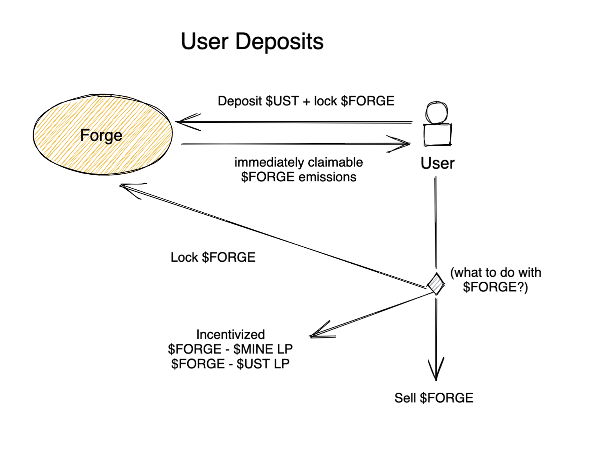
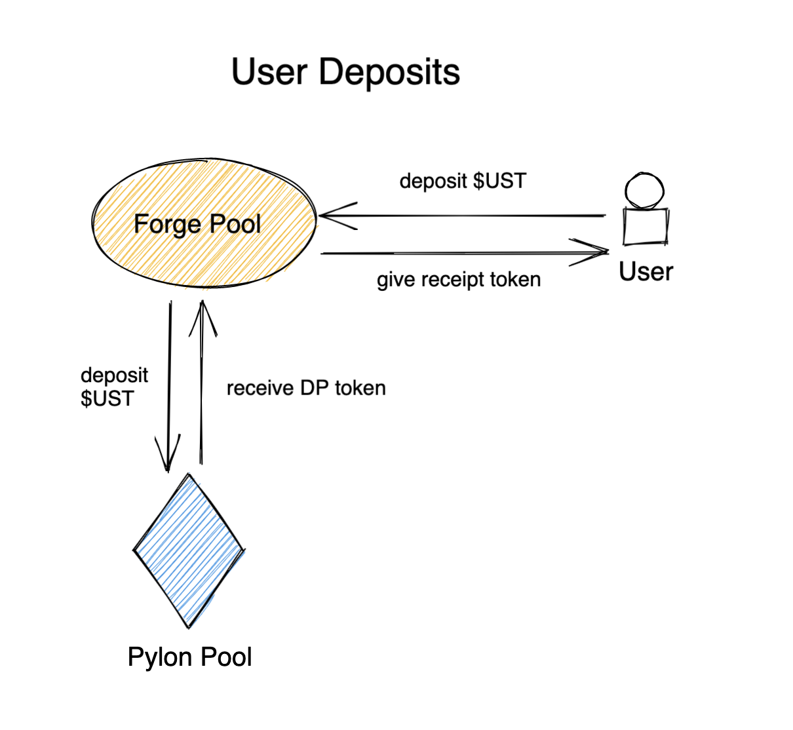

# FORGE PROTOCOL

Forge aims to upgrade Pylon deposit pools by launching 2 companion pools with unique benefits for each Pylon Gateway launch: a yield-boosted pool and a yield-insured pool. Users must also lock some $FORGE to deposit into one of these pools. Depositors in the yield-insured pool redirect most of their Pylon rewards to the yield-boosted depositors. However, the locked $FORGE of yield-boosters is in return at risk--the yield-insured depositors may redeem their reward tokens against it at any time. The boost/insurance rate scales with locked $FORGE value on a per block basis.

Forge users will earn $FORGE emissions per block for depositing. The option for users to sell at any time is a feature to offset the biggest risk of Pylon pools, the long-term locking of liquidity. Giving users a liquid yield decreases that risk for users and may defend the reward token from being dumped at pool expiry.

The $FORGE locks should last for some predetermined (TBD) time after the underlying Pylon pools end. Varying lock times may be considered but seem complex, and fragmenting locked $FORGE liquidity feels pretty bad since boost/insurance pools must coexist. As long as the lock period persists, insurance redemptions should be respected.

# $FORGE

To get the ball rolling, Forge treasury should seed initial amounts of locked $FORGE for each pool, and a mechanism to ensure a robust $FORGE treasury should be determined (e.g. withdrawal fees and/or keeping a percentage of reward tokens). Since each of these pools reaps their benfits from the other, users should be incentivized to deposit into the lagging pool until a balance is reached.

For projects where sentiment is bullish, we expect a larger pool of boosting locked $FORGE, which should in turn increase the floor rate for insured depositors. The insurance rate in this case should trend towards competitive with a user depositing into Anchor Earn to attract investors who may not even be that interested in the underlying reward token.

<!-- TODO: diagram -->

For projects where sentiment is bearish, we might expect more depositors seeking insured yield. The boosted rate in this case should be among the most attractive APRs on Terra. Alternatively there may just be low demand for $FORGE at this time. Since there is risk of large amounts of $FORGE dumping after a pool unlocks, an attractive $FORGE single-asset stake should be implemented as well (e.g. a portion of reward tokens earned from other Forge pools).

## Possibilities

- Since sentiment changes over time, adaptive rates may be determined linked to projects hitting certain milestones.
- This model can be applied to any yield-bearing asset like LP tokens as well, although some changes would need to be made.

## Protocol actors

- Boost depositors: increase demand for $FORGE at launch of bullish projects
- Insurance depositors: increase demand for $FORGE at launch of bearish projects or when too many boost depositors
- Pylon/Project teams: beneficiaries of Forge by driving $UST deposits

## Governance

We want to tie governance rights to monetary incentive as closely as possible. All of the following parameters are candidates for governance votes per launch:

- Initial seeding
- Lock time
- Boost rate (rate of change + max)
- Insurance rate (rate of change + max)
- Fees

# Current state

The code in this repository defines a smart contract that users can deposit funds into. Each implementation of this contract should be 1:1 with a corresponding Pylon Pool contract where user funds will be directed to under the hood. As far as Pylon is concerned, Forge would just be one large depositor (subject to change if Pylon enacts deposit limits per user, but a whitelist would allow for this in this case).

# Run/Deploy

- `cargo wasm` to build
- `cargo run-script optimize` to minimize the WASM binary
- `cargo schema` to generate the JSON schema
- `npm run start` to deploy the contract to `tequila-0004` testnet

# Theoretical Launch Roadmap

## 1. Seed liquidity across Terra users

A launch via Pylon makes sense since Forge's primary purpose is to further incentivize utilization of Pylon Gateway pools beyond its current appeal.

## 2. Incentivized LP pools

Inflation should allow for $FORGE to land in as many wallets as possible and/or afford users time to accumulate.

## 3. Deposit Pools

$FORGE lock pools and rates.

## 4. Redemption for yield-insured

Technically this does not need to be complete when deposits open. However it'd be negligent to open for deposits without this.
