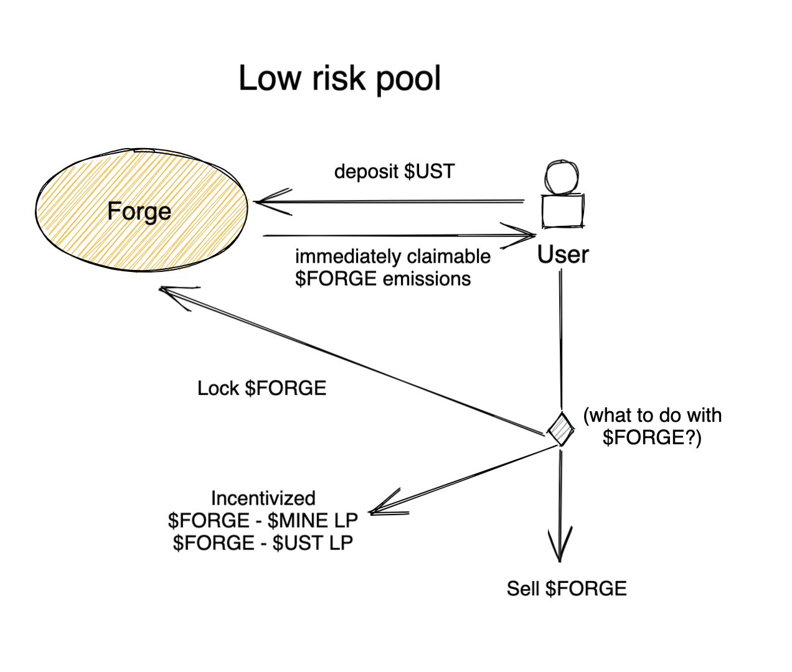
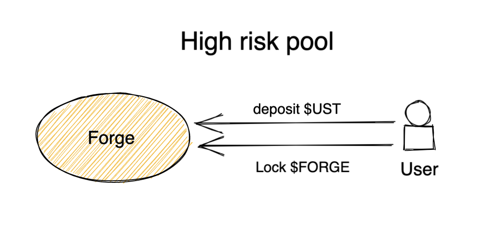
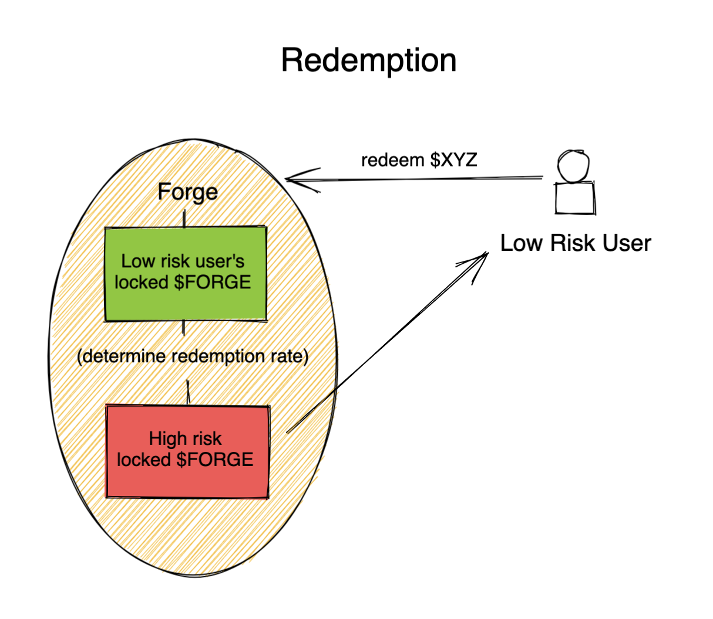
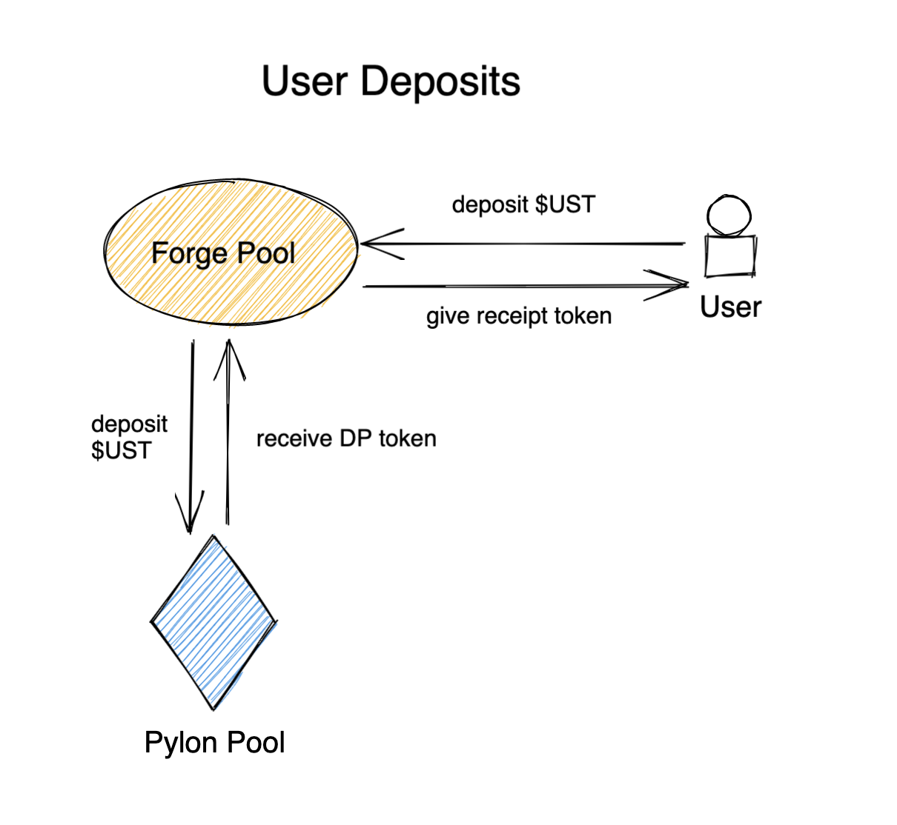

# FORGE PROTOCOL

Forge aims to give investors depositors additional risk options for Pylon Pool deposits by launching 2 companion pools for each Pylon Pool. One pool will be for the lower risk investors who want a more stable and liquid yield, and another that gives depositors enhanced emissions of the Pylon Pool's reward token.

In the lower risk pool, investors will redirect a large part of their reward yield to the enhanced emissions pool in exchange for yield insurance.

The enhanced emissions pool is a higher risk strategy. If foregoing depositing $UST into Anchor Earn is the opportunity cost of Pylon pools, a price can be estimated for the pool's reward token. Entering this pool can dramatically lower that cost basis.
 /_ TODO: show receipt of locked $FORGE and DP Tokens _/
To enter the enhanced emissions pool, users will also need to lock some $FORGE. The amount of locked $FORGE will determine the extent of the reward token emissions boost (up to a determined maximum boost). These depositors' locked $FORGE is also at risk of loss as the backstop for low-risk depositors.

Since each of these pools depends on the other, users should be incentivized to deposit into the lagging pool when they are unbalanced. For projects where people are generally bullish, we expect more high-risk depositors, which should in turn increase the floor rate for low-risk depositors. For projects where people are generally bearish, we expect more low-risk depositors, which should in turn increase the yield for high-risk depositors.

Forge treasury may need to seed liquidity for each pool...

# Current state

The code in this repository defines a smart contract that users can deposit funds into. Each implementation of this contract should be 1:1 with a corresponding Pylon Pool contract where user funds will be directed to under the hood. As far as Pylon is concerned, Forge would just be one large depositor (subject to change if Pylon enacts deposit limits per user, but a whitelist would allow for this in this case).

# Run/Deploy

- `cargo wasm` to build
- `cargo run-script optimize` to minimize the WASM binary
- `cargo schema` to generate the JSON schema
- `npm run start` to deploy the contract to `tequila-0004` testnet

# Theoretical Launch Roadmap

## 1. Seed liquidity

A launch via Pylon makes sense since Forge's primary purpose is to further incentivize utilization of Pylon Gateway pools beyond its current appeal.

## 2. Open Incentivized LP Pools

Inflation should allow for $FORGE to land in as many wallets as possible. The buy-in for risk-takers should be low, whereas risk-averse users will be afforded an opportunity to accumulate.

## 3. Locked $FORGE tokens

While low-risk pools can open without locking $FORGE, they need high-risk deposits to have any value, and $FORGE needs to be locked for high-risk pools to open.

## 4. Deposit Pools

Technically redemption doesn't need to be implemented at this stage. However it may make sense to have it ready/public at the same time as deposit pools because otherwise the low-risk depositors would actually be at risk.
