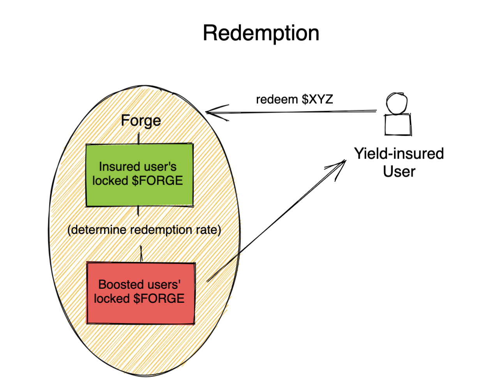

# FORGE PROTOCOL

# Current state

The code in this repository defines a smart contract that users can deposit funds into. Each implementation of this contract should be 1:1 with a corresponding Pylon Pool contract where user funds will be directed to under the hood. As far as Pylon is concerned, Forge would just be one large depositor (subject to change if Pylon enacts deposit limits per user, but a whitelist would allow for this in this case).

## $FORGE

The $FORGE governance token's primary purpose is to further incentivize utilization of Pylon Gateway pools beyond its current appeal. Therefore a launch via Pylon makes a lot of sense to seed initial liquidity.

## Run/Deploy

- `cargo wasm` to build
- `cargo run-script optimize` to minimize the WASM binary
- `cargo schema` to generate the JSON schema
- `npm run start` to deploy the contract to `tequila-0004` testnet
